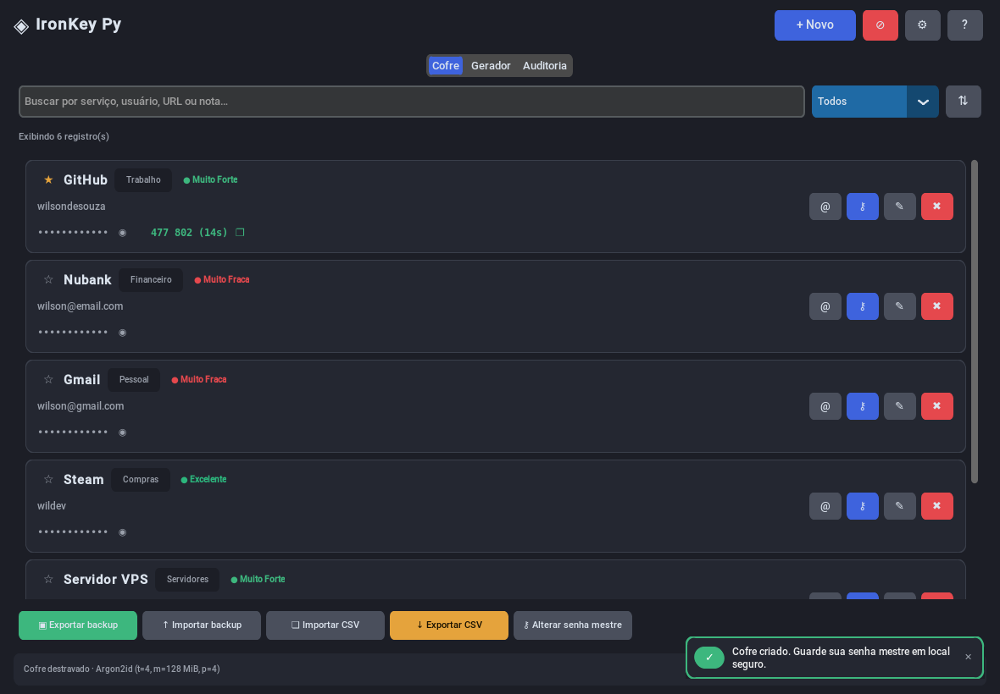
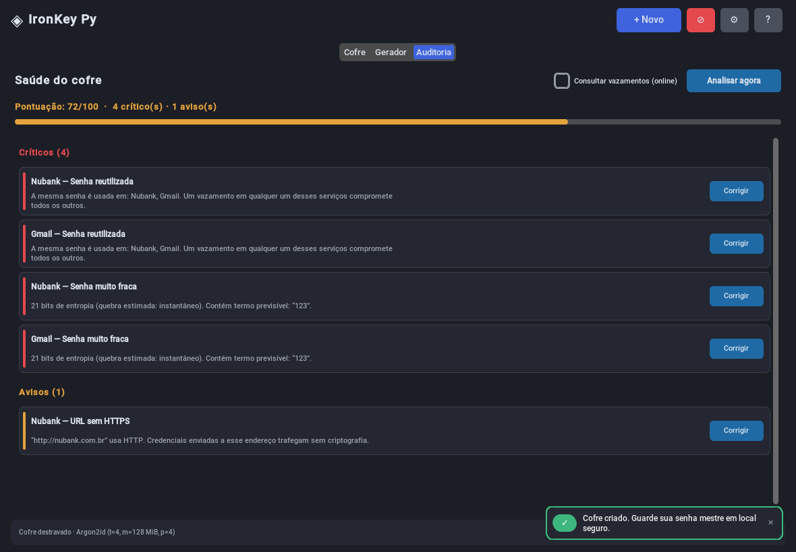

# 🔐 IronKey Py — Gerenciador de Senhas Seguro

Gerenciador de senhas desktop, offline e de código aberto, escrito em Python.
Seus dados ficam **no seu dispositivo**, cifrados com **AES-256-GCM** sob uma chave
derivada por **Argon2id** — nada é enviado para nenhum servidor.

<div align="center">


</div>

<div align="center">
  
  
</div>

---

## ✨ Principais recursos

### 🔒 Segurança
- **Argon2id** (`t=4, m=128 MiB, p=4`) para derivar a chave da senha mestre — com PBKDF2-SHA256 600k como alternativa
- **AES-256-GCM** com dados associados: cifra e autentica ao mesmo tempo, detectando adulteração
- **Registro inteiro cifrado** — site, usuário, URL, notas, categoria e segredo TOTP, não só a senha
- Envelope **KEK/DEK**: trocar a senha mestre é instantâneo e não reescreve o cofre
- **Limite de tentativas** com espera exponencial, persistida entre execuções
- **Bloqueio automático** por inatividade e limpeza automática da área de transferência
- Escrita atômica do cofre e permissões `0600`/`0700` (POSIX)

### 🗂️ Cofre
- Campos completos: serviço, usuário, URL, senha, **TOTP**, notas, categoria e favoritos
- **Busca instantânea** por qualquer campo, com filtros (fracas, reutilizadas, favoritas, com 2FA) e ordenação
- **Histórico de senhas** cifrado a cada alteração
- Códigos **2FA (TOTP/RFC 6238)** exibidos ao vivo no card, com contagem regressiva

### 🩺 Auditoria
- Detecta senhas **reutilizadas**, **fracas**, **antigas**, **vazadas** e **URLs sem HTTPS**
- Pontuação 0–100 e botão "Corrigir" que abre o registro problemático
- Consulta opcional ao **Have I Been Pwned** por *k-anonymity* (só 5 caracteres do hash saem da máquina)

### 🎲 Gerador
- Senhas aleatórias de até **128** caracteres via `secrets`, com amostragem por rejeição (sem viés)
- **Frases-senha** estilo Diceware com 1.184 palavras em português (~10,2 bits por palavra)
- Exclusão de caracteres ambíguos (`0/O`, `1/l/I`), modo "só símbolos seguros para URL" e lista de exclusão própria
- Medidor de **entropia real em bits** com tempo estimado de quebra

### 🔄 Sincronização entre dispositivos *(novo na 2.1)*
- **Mesmo cofre no desktop e no celular** usando uma pasta que você já sincroniza
  (Google Drive, OneDrive, Dropbox, Syncthing).
- **Mesclagem registro por registro**, não cópia de arquivo: editar nos dois lados não apaga nada
- Exclusões se propagam; em edição simultânea do mesmo registro, **as duas versões sobrevivem**
  e o conflito aparece para revisão
- Sincroniza ao destravar, ao sair e a cada intervalo configurável, sempre em segundo plano
- **Zero conhecimento**: o provedor de nuvem recebe apenas ciphertext (AES-256-GCM) e metadados
  de tamanho/horário — nunca senha mestre, KEK, DEK ou qualquer campo do cofre
- Arquivo de **entrada de dispositivo** (`.ikenr`) para colocar um segundo dispositivo no mesmo
  cofre, protegido pela senha mestre

### 💾 Backup e migração
- **`.ikbak`**: backup portátil, autocontido e cifrado com senha própria — restaura em qualquer máquina
- **Importação de CSV** do Bitwarden, LastPass, Chrome e KeePass
- **Exportação CSV** com confirmação explícita (é texto puro!)
- Cofres da versão 1.x são **migrados automaticamente** no primeiro desbloqueio

### 🎨 Interface
- Temas claro/escuro/sistema e escala de 80 % a 160 % (acessibilidade)
- Notificações não-bloqueantes, com "Desfazer" em exclusões
- 10 atalhos de teclado (`F1` mostra todos)
- Funciona sem fonte de emoji instalada (Linux minimalista) — os ícones têm alternativa garantida

---

## 🚀 Instalação

```bash
git clone https://github.com/wilsondesouza/IronKeyPy.git
cd IronKeyPy

python -m venv .venv
source .venv/bin/activate      # Windows: .venv\Scripts\activate

pip install -r requirements.txt
python main.py
```

Requisitos: **Python 3.10+**. Em Linux, o Tk precisa estar presente
(`sudo apt install python3-tk`).


## ⌨️ Atalhos

| Atalho | Ação | Atalho | Ação |
|---|---|---|---|
| `Ctrl+N` | Novo registro | `Ctrl+E` | Exportar backup cifrado |
| `Ctrl+F` | Buscar | `Ctrl+,` | Configurações |
| `Ctrl+G` | Ir para o gerador | `Ctrl+H` | Mostrar/ocultar campo em foco |
| `Ctrl+L` | Bloquear o cofre | `F1` | Ajuda |
| `F5` | Recarregar a lista | `Esc` | Fechar diálogo / limpar busca |
| `Ctrl+Shift+S` | Sincronizar agora | `Ctrl+Shift+K` | Conflitos de sincronização |

---

## 📁 Onde ficam os dados

| Sistema | Caminho |
|---|---|
| Windows | `%APPDATA%\IronKeyPy\` |
| macOS | `~/Library/Application Support/IronKeyPy/` |
| Linux | `~/.config/IronKeyPy/` (respeita `$XDG_CONFIG_HOME`) |

Arquivos: `config.json` (cabeçalho do cofre: salt, parâmetros de KDF e a chave
de dados embrulhada), `ironkeypy.db` (registros cifrados), `settings.json`
(preferências) e `state.json` (controle de tentativas).

Na **pasta de sincronização** ficam apenas `ironkeypy-sync.ikbak` (conteúdo cifrado) e `ironkeypy-sync.manifest.json`
(gatilho com hash e geração, em texto claro mas autenticado por HMAC — revela
tamanho, horário e um identificador do cofre, nunca conteúdo).

---

## 🏗️ Estrutura

```
IronKeyPy/
├── main.py                 # controlador da aplicação
├── ui/                     # tema, widgets, telas e diálogos
├── services/               # criptografia, gerador, TOTP, backup, auditoria…
├── database/               # persistência cifrada em SQLite
├── api/                    # consulta ao Have I Been Pwned
├── tests/                  # 102 testes automatizados
├── docs/                   # planejamento multiplataforma e contrato de sincronização
└── assets/
```

---

## 🔐 Segurança

O modelo de ameaças, as escolhas criptográficas e — principalmente — **o que
este programa não protege** estão em **[SECURITY.md](SECURITY.md)**.
Leia antes de confiar dados reais a ele.

Resumo do essencial:

- A senha mestre **não é armazenada em lugar nenhum**. Se você perdê-la, os
  dados são irrecuperáveis. Isso é o desenho, não um defeito.
- Nenhum gerenciador de senhas resiste a malware ativo na sua sessão. Mantenha
  o sistema atualizado e o disco cifrado.
- Exporte um `.ikbak` periodicamente e guarde-o fora da máquina.

O histórico completo de correções de segurança, bugs e melhorias de usabilidade
está em **[RELATORIO-DE-MELHORIAS.md](RELATORIO-DE-MELHORIAS.md)**.

---

## 📄 Licença

MIT.

## 🤝 Contribuindo

*Issues* e *pull requests* são bem-vindos. Antes de enviar, rode
`python -m unittest discover -s tests -t .` e nunca inclua dados reais do seu
cofre em capturas de tela ou anexos.
